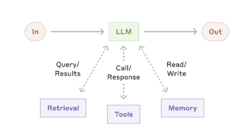

[原文 Building effective agents](https://www.anthropic.com/engineering/building-effective-agents)
# Agent vs Workflow
都属于**agentic systems**
- Agent: LLM自己动态决定处理过程和工具的使用，适用于灵活且需要大模型来做决策的场景。
- Workflow: 通过预定义的流程编排LLM和工具的使用，适用于任务明确的场景，有更好的可预测性和一致性。

对于大部分应用来说，通过检索增强以及在上下文中给一个示例，来优化单个LLM的调用就已经足够了。

建议不要一开始就使用Agent框架，可能会隐藏一些prompt和LLM响应的细节，导致不容易debug；以及框架总是会引诱用户不自觉的为Agent应用增加一些不必要的复杂度。

# Patterns

## The augmented LLM

即单个LLM可以使用检索增强、工具使用、记忆管理功能。一种简单的实现方式是使用MCP协议，注意要确保给LLM提供的是有良好文档说明的接口。

## Workflow: Prompt chaining

把任务拆解为一系列步骤，前一个LLM的输出是后一个LLM的输入，可以在适当的位置添加一个检查程序或判断LLM，以确保任务流程按照理想的方向运行。

适用于可以将任务拆解为简单、清晰的小任务的场景；牺牲了运行效率，但每个LLM专注于处理单个子任务，可以提高任务整体的准确性。

典型应用场景举例：

- 文档写作：先编写文档大纲，再检查文档大纲是否满足特定的要求，最后根据大纲生成文档内容。

## Workflow: Routing

