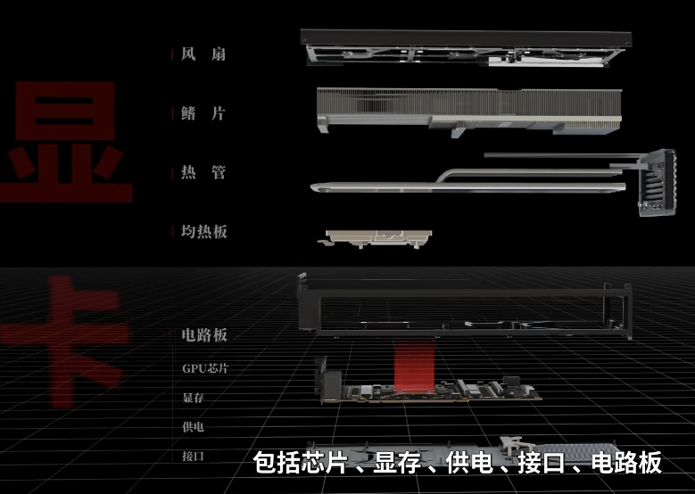

# 显卡基本结构

【【硬核科普】从零开始认识显卡】 https://www.bilibili.com/video/BV1xE421j7Uv/?share_source=copy_web&vd_source=8696b0300d8768b6657ac38806aa5330

- 显卡由电路板和散热模组组成
- 显卡电路板可认为由四个部分组成：GPU、显存、供电模块、接口
- 接口包括视频接口和PCIE接口
	- 视频接口：将运算好的图像发送给显示器
	- PCIE接口：和CPU、内存交互数据
# GPU
[GPU架构与计算入门指南]https://hub.baai.ac.cn/view/32218
- 游戏画面渲染的本质：把3D物体的空间三角形，通过矩阵变换投影到摄像机视角下的二维屏幕上，确定每个三角形的二维形状后，结合光照与纹理计算每个像素的颜色。
- 现代图形处理的大多数底层运算都可以归结为以“乘加”为核心的线性代数运算。
- GPU是为“同一运算、大量数据”的任务设计的，而图形渲染正是这种任务：把相同的数学规则应用到成千上万个像素、顶点或光线中。
Hopper架构（H100）

- SM：流式多处理器，是包含多个处理器的单元
	- CUDA Core：CUDA核心，可视为简单的计算器，可计算整型和浮点数的乘法和加法
	- Tensor Core：张量计算核心，专注于矩阵的乘法和加法
	- RT Core：RAY Tracing 光追核心 
	- L1 Cache：每个SM独享，硬件自动管理的高速缓存
	- SFU：特殊功能单元，专门计算特殊数学函数的单元，如sin、cos、sqrt、exp
	- LD/ST：数据加载/写入单元，处理寄存器与Cache/Shared Memory/HBM之间的数据传输
	- Register File：统一存放各个线程使用的寄存器，寄存器为线程独享
	- Shared Memory：实际上和L1 Cache共用同一片物理存储资源，但可通过编程定义及访问，属于用户可手动管理的内存，同一线程块内所有线程可共享访问，用于数据共享和交换
	- TMA：专为Tensor Core设计的内存搬运加速引擎，能够以矩阵块为单位高效异步传输数据，将数据从HBM/L2 Cache搬运到Shared Memory
- GPC：图像处理集群，包含多个TPC
- TPC：纹理处理集群：包含多个SM
```markdown
GPU
├── GPC 0
│    ├── TPC 0
│    │     └── SM 0
│    │     └── SM 1
│    └── TPC 1
│          └── SM 2
│          └── SM 3
├── GPC 1
│    └── ...
└── GPC n
```
- NVENC视频编码器：把视频转换成新的数据格式或大小
- NVDEC视频解码器：把数据流转换为视频画面
- 显存控制器：控制GPU与显存交互
- PCIE控制器：控制GPU与CPU、内存等主板上元器件交互
- SIMD：单指令多数据，同一指令可应用到多个不同的数据上
- SIMT：单指令多线程，可以理解为是SIMD的改进
- Grid网格：是GPU启动的整个任务的集合，由多个线程块组成，每次CUDA kernel 启动时，会定义网格的规模
```markdown
Grid（网格）
└── Block（线程块）
    └── Warp（硬件调度单元）
        └── Thread（线程）
```
- Thread Block线程块：是一组可以共享资源的线程，一个线程块只能在一个SM上执行，以充分利用数据的局部性。但一个SM可以同时驻留多个线程块，这些线程块并发排队执行。如果线程块较大，GPU内部会按wrap为单位进行调度，这也就意味着线程块中的线程是会被分批、交错调度执行的。
- 程序员必须手动指定网格大小和线程块大小
```cpp
kernel<<<numBlocks, threadsPerBlock>>>(...);
```
> 当一个核函数（kernel）在GPU上执行时，以下是执行流程：
>1. **线程块划分**：核函数的所有线程被划分成多个线程块。
>2. **Warp划分**：每个线程块被进一步划分成多个Warp，每个Warp有32个线程。
>3. **调度和执行**： 每个Warp被分派到一个SM的Warp调度器上。Warp中的32个线程被分配到SM内的CUDA Core上执行。由于Warp中的线程执行相同的指令，所以多个CUDA Core可以同时并行执行这些线程。
```markdown
GPU
└── SM 0
     ├── Thread Block A
     │     ├── Warp 0 （32个线程）
     │     ├── Warp 1 （32个线程）
     │     └── ...（共8个warp）
     └── Thread Block B
           └── ...
```
- WARP：是GPU硬件内部以32个线程为单位的实际调度粒度。这些线程同时执行相同的指令，但操作不同的数据。
- TFlops：Tera Floating Point Operations Per Second 的缩写，表示每秒万亿次浮点运算。
# 显存
- HBM（High Bandwidth Memory）通过堆叠内存芯片（dies），在单个封装内实现多层内存堆叠，并使用宽的总线（通常为1024位）连接到GPU或CPU，从而提供极高的内存带宽。相比传统GDDR5/6显存，HBM能够提供数倍的带宽。
- 显卡制造商在选择HBM或GDDR显存时，会综合考虑性能需求、成本、功耗和市场定位等因素。HBM显存通常用于需要极高带宽和能效的专业计算和高端图形应用，而GDDR显存则在高性能游戏和主流市场中更为常见。
# NVLink
- 一种点对点高速互联总线
- 直接连接两个设备之间（GPU↔GPU或GPU↔CPU）
- 适用于少量GPU的互联
# NVSwitch
 - 一种中心式互联交换芯片（集成多个 NVLink 端口）
 - 通过中间交换芯片连接多个 GPU
 - 自动构建对称全互联网络
 # RDMA
 - 用于服务器之间互联通信
 - 最常见的是InfiniBand和RoCE，前者是由 Mellanox/NVIDIA 主导的专有协议栈，必须使用专有网络设备，延迟和稳定性比RoCE较强；后者是公开标准，支持标准以太网设备
 - NVLink/NVSwitch在单机内通信速度远高于 RDMA，但 RDMA 是跨服务器通信中效率最高的方案
# Magnum IO


 # GPU虚拟化
## GPU直通

GPU Passthrough，将一整块GPU设备直通给一台虚拟机，该虚拟机独占该GPU的使用权。

优点：性能几乎等同原生，隔离性强

缺点：资源利用率低

## API劫持

API Remoting，典型代表为VCUDA (一种CUDA API劫持技术) 

一种软件级 GPU 虚拟化方式，通过在虚拟机中拦截图形API调用（如CUDA、OpenGL、DirectX），将其重定向到宿主机的真实 GPU 上执行，并将渲染结果返回给虚拟机。

无需硬件支持，成本较低，适合**轻量远程桌面**使用，但无法胜任现代 AI 和高性能计算场景。

## vGPU

早期叫Grid vGPU，是 NVIDIA 设计的硬件级 GPU 虚拟化解决方案，基于专用驱动和硬件支持实现。

| **组件**         | **作用说明**                                                 |
| ---------------- | ------------------------------------------------------------ |
| **vGPU Manager** | 安装在宿主机 Hypervisor ，管理物理 GPU 显存分配与调度        |
| **vGPU Driver**  | vGPU Host Driver，驱动物理 GPU，支持 vGPU 功能；<br />vGPU Guest Driver，提供虚拟 GPU 的使用能力（图形或计算） |
| **GPU Profile**  | 定义 vGPU 分配多少显存/编码器资源等，比如 T4-4Q 表示 4GB 显存的 Quadro Profile |

性能较高，硬件级隔离；灵活 Profile，可按需分配显存资源。缺点是只能在NVIDIA专用硬件中使用，且需要license。

## MPS

Multi-Process Service

**原理**：允许多个 CUDA 进程共享同一块 GPU，通过在用户态启动一个 MPS Server 进程，协调多个 client 进程的执行，以实现共享 CUDA core 和 SM。适合一个用户多进程的计算密集场景。

- MPS 是一个后台服务，多个 CUDA 应用程序并不会直接与 GPU 通信，而是通过 MPS Server 转发指令到 GPU
- 可以减少GPU上下文切换、提高核利用率，尤其对多进程的小任务计算场景很有用
- MPS Server 会为所有 MPS Client（即 CUDA 进程）共享一个 GPU 上下文（即一个 CUDA Context，这两个术语是等价的）

- 只支持 CUDA，不支持图形应用
- 仅支持 NVIDIA 的 Tesla 和 A 系列的数据中心 GPU

虽然共享 上下文，但每个进程分配的 **GPU 显存空间是相互隔离的**。如果一个进程大量占用显存，可能会**影响其他进程的内存分配**，导致其运行失败（如 OOM），但不会导致越权访问其他进程的显存数据，仍有基本的进程地址空间保护。
## MIG

Multi-Instance GPU，是一种硬件级资源隔离技术，只在最新型号的GPU（A100 H100）具备。
MIG将一块物理GPU划分成多个彼此完全隔离的小GPU实例，每个小GPU实例拥有独立的硬件资源（SM、显存、L2 Cache、Scheduler），可作为一个完整的GPU分配给虚拟机或容器使用。目前一块A100最多可划分出7个MIG。

# 容器中使用GPU

k8s+vGPU

k8s+MIG
