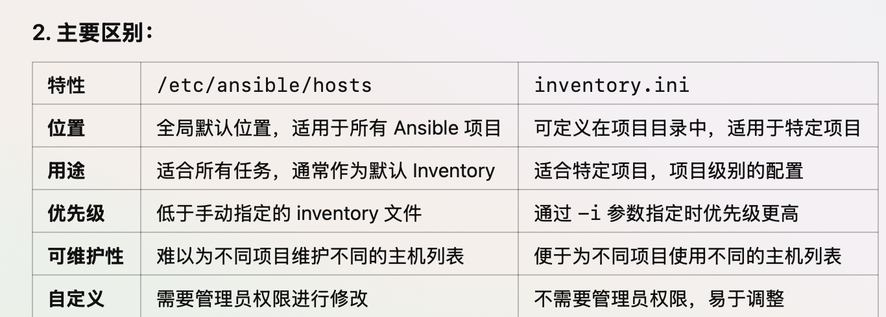

# 安装
- 以Ubuntu系统为例
```shell
sudo apt update
# software-properties-common是一个管理 PPA（Personal Package Archive，个人软件包存档）的工具包，提供 add-apt-repository 命令
sudo apt install software-properties-common
# 添加 Ansible 官方 PPA 源
sudo add-apt-repository --yes --update ppa:ansible/ansible
sudo apt install ansible
# 验证
ansible --version
```
> 附：什么是PPA？
> PPA 是 Ubuntu 提供的一个**第三方软件仓库**，通常由软件开发者、社区或企业维护，允许提供官方仓库未包含的软件，或者提供更**新版本**的软件。
# 使用
## 配置要控制的主机
 1. 编辑配置文件，通常位于`/etc/ansible/hosts`
```config
# 定义了1个主机组和其中的2台主机
[appServers]
113.44.240.123
49.4.115.42
```
2. 执行`ansible-inventory --list -y` ，以 **YAML 格式** 显示当前 Ansible 清单（inventory）中的主机和组信息
3. 在控制节点执行`ssh-keygen`生成SSH公私钥，然后将公钥复制到slave节点上`/root/.ssh/authorized_keys`
```shell
ssh-keygen
ssh-copy-id root@slaveNode_address
```
4. 控制节点执行`ansible all -m ping -u root`命令检测连通性是否正常
## QuickStart
参考： https://docs.ansible.com/ansible/latest/getting_started/index.html
### inventory
> 定义Ansible要控制的节点列表

https://docs.ansible.com/ansible/latest/inventory_guide/intro_inventory.html
- /etc/ansible/hosts：适用于全局的 Ansible 设置，通常由系统管理员维护，默认会被 Ansible 读取
- inventory.ini：适用于特定项目，存放在项目目录中，方便携带、调整和版本管理，优先级高于默认配置。可以是ini格式也可以是yaml格式

### playbook

| 概念        | 说明                                             |
| --------- | ---------------------------------------------- |
| Playbook  | 定义要执行的自动化任务脚本                                  |
| Play      | 任务执行单元，确定主机和任务                                 |
| Hosts     | 目标主机，在哪些服务器上执行任务                               |
| Tasks     | 具体的操作步骤(如安装包、修改配置等)                            |
| Module    | 提供执行任务的功能模块(如 yum, copy)                       |
| Handlers  | 仅在发生变化时执行的任务(如重启服务)                            |
| Variables | 在 Playbook 中定义的变量                              |
| Templates | 用于动态生成配置文件                                     |
| Roles     | 结构化组织任务的方式，将任务、变量、文件、模板等组件模块化，从而提高playbook的复用性 |
| Tags      | 选择性地执行特定任务                                     |
#### Demo-安装Nginx

- 多个inventory
- 安装


template 和 file（或 copy）的主要区别在于**是否需要动态渲染文件**，**模板文件**用于动态渲染，通常包含 **Jinja2 变量**，在复制到目标主机前会被 Ansible 处理
模板里的变量（{{ my_variable }}）的值来自 Ansible **变量系统**

```shell
ansible-playbook --check playbook.yaml
ansible-lint verify-apache.yml
```