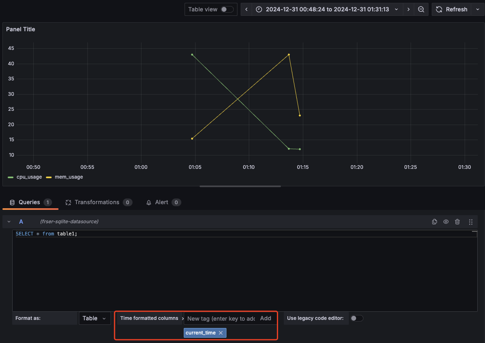

# 下载安装包
## 直接下载二进制包
下载并解压，缺点是无法作为系统服务启动
## 下载rpm包或者deb包，然后用包管理工具安装
```shell
curl -O https://dl.grafana.com/enterprise/release/grafana-enterprise-11.4.0-1.x86_64.rpm

yum install grafana-enterprise-11.4.0-1.x86_64.rpm
```
# 启动
## 如果是二进制安装
进入安装目录
```shell
./bin/grafana server
```
## 如果是包管理工具安装
```shell
### please execute the following statements to configure grafana to start automatically using systemd
 sudo /bin/systemctl daemon-reload
 sudo /bin/systemctl enable grafana-server.service
### You can start grafana-server by executing
 sudo /bin/systemctl start grafana-server.service
```
默认端口是3000，访问http://{IP}:3000/login，初识用户名和密码都是admin
可以通过`systemctl status`命令查看启动时读取的哪里的配置文件，一般是`/etc/grafana/grafana.ini`
# 下载插件并安装
## 插件下载到本地安装
以CSV数据源插件为例
1. 找到软件包地址 https://github.com/grafana/grafana-csv-datasource/releases
2. 下载到本地，使用grafana-cli工具安装
```shell
grafana-cli --pluginUrl ./marcusolsson-csv-datasource-0.6.21.linux_amd64.zip plugins install marcusolsson-csv-datasource
```
3. 在配置文件中找到plugins所在的目录，一般是`/var/lib/grafana/plugins` ，检查这个目录的属主是否为grafana，若不是则修改
```shell
chown -R grafana:grafana /var/lib/grafana/plugins
```
4. 重启grafana服务

SQLite数据源插件
[[SQLite使用]]
```shell
grafana-cli --pluginUrl https://github.com/fr-ser/grafana-sqlite-datasource/releases/download/v3.5.0/frser-sqlite-datasource-3.5.0.zip plugins install frser-sqlite-datasource
```
注意时间列要么是时间戳数字，要么是符合**RFC3339**标准的时间字符串
