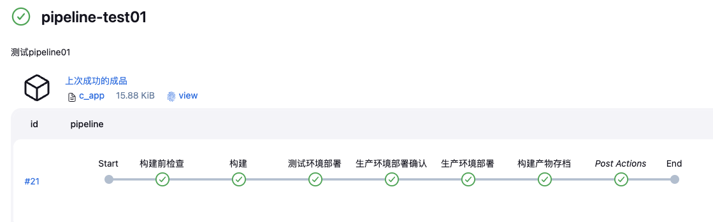
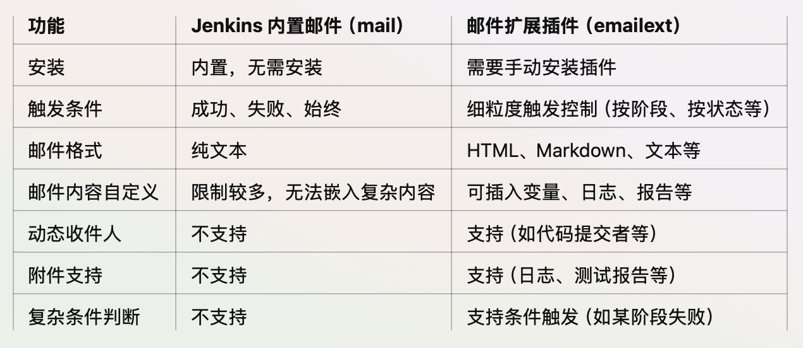

# 参考文档
https://www.jenkins.io/doc/book/installing/linux/#debianubuntu
注意尽量参考官方最新文档，而不是中文文档（很有可能已失效）
# 安装
```shell
# 下载 Jenkins GPG 公钥并存储在 keyring 文件中
sudo wget -O /usr/share/keyrings/jenkins-keyring.asc \
  https://pkg.jenkins.io/debian/jenkins.io-2023.key
# 添加 Jenkins APT 软件源
echo "deb [signed-by=/usr/share/keyrings/jenkins-keyring.asc]" \
  https://pkg.jenkins.io/debian binary/ | sudo tee \
  /etc/apt/sources.list.d/jenkins.list > /dev/null
# 更新 APT 软件包索引
sudo apt-get update
# 安装
sudo apt-get install jenkins
```
执行上述命令后会
- 创建Jenkins用户
- 自动将Jenkins添加到系统服务并启动
## 报错排查
```shell
# 查看Jenkins系统服务配置
systemctl cat jenkins
# 查看Jenkins系统服务日志，-u 指定具体系统服务
journalctl -u jenkins.service

```
## 前置条件
Jenkins运行依赖Java环境
```shell
sudo apt update
sudo apt install fontconfig openjdk-17-jre
```
注意配置JAVA_HOME环境变量
# 使用
## 第一次登录
默认访问端口为8080
1. 第一次登录时会要求输入初始密码，可在下列文件中查找
```shell
cat /var/lib/jenkins/secrets/initialAdminPassword
```
2. 按需求安装各类插件
3. 创建用户
## Pipeline
- 工作目录：Jenkins 为每个构建作业分配的临时目录，通常位于 Jenkins 配置的 workspace 目录下`/var/lib/jenkins/workspace/<job-name>`
- Jenkinsfile可参考官方文档入门： https://www.jenkins.io/zh/doc/pipeline/tour/hello-world/
- Jenkinsfile可使用vscode插件进行验证，可参考： https://juejin.cn/post/7193910998279913530
### Jenkinsfile Demo

```groovy
pipeline {
    agent any  // 在任何可用的 Jenkins 节点上运行
    stages {
        stage('构建前检查') {
            steps {
                script {
                    def filePath = '/var/lib/jenkins/c_source/c_code.c'
                    if (fileExists(filePath)) {
                        echo "File ${filePath} exists, proceeding with the build."
                    } else {
                        // 如果文件不存在，停止构建，error 语句会终止流水线并标记构建失败
                        error "File ${filePath} not found! Stopping the build."
                    }
                }
            }
        }
        stage('构建') {
            steps {
                script {
                    echo "执行构建阶段..."
                    sh 'gcc -o /var/lib/jenkins/c_bin/c_app /var/lib/jenkins/c_source/c_code.c'  //执行构建命令
                    sh 'mkdir -p $WORKSPACE/artifacts/ && cp /var/lib/jenkins/c_bin/c_app $WORKSPACE/artifacts/' // 将构建产物复制到自定义的artifacts 目录
                }
            }
        }
        stage('测试环境部署') {
            steps {
                script {
                    echo "部署测试环境阶段..."
                    sh '/var/lib/jenkins/c_bin/c_app 测试环境'  // 执行部署脚本
                    sh 'cat $WORKSPACE/output'
                }
            }
        }
        stage('生产环境部署确认') {
            steps {
                script {
	                // 定义人工输入环节
                    def userInput = input(
                        id: 'approval', // 唯一 ID
                        message: '确认部署至生产环境?', // 提示信息
                        parameters: [
                            choice(name: 'Proceed', choices: ['Yes', 'No'], description: 'Do you want to proceed?')
                        ]
                    )
					// 如果用户选择 No，终止流水线并标记构建失败
                    if (userInput == 'No') {
                        error("Deployment to production was aborted by the user.")
                    }
                }
            }
        }
        stage('生产环境部署') {
            steps {
                script {
                    echo "部署生产环境阶段..."
                    sh '/var/lib/jenkins/c_bin/c_app 生产环境'  // 执行部署脚本
                    sh 'cat $WORKSPACE/output'
                }
            }
        }
        stage('构建产物存档') {
            steps {
			    // 可以在Jenkins UI页面下载构建产物
                archiveArtifacts artifacts: 'artifacts/*', fingerprint: true
            }
        }
        
    }

    post {
        always {
            echo "流水线执行完毕，发送邮件通知..."
            // 可使用内建环境变量
            emailext(
                to: 'xmz_abc@163.com',   
                subject: "Jenkins Pipeline 执行完成: ${currentBuild.fullDisplayName}",
                body: """
                Hi team,

                The Jenkins pipeline has completed.

                * Job Name: ${env.JOB_NAME}
                * Build Number: ${env.BUILD_NUMBER}
                * Status: ${currentBuild.currentResult}

                Regards,
                Jenkins
                """,
                attachLog: true
            )
        }
    }
}

```
## Plugins
### 邮件通知
- Jenkins内置了邮件通知功能，同时也有邮件扩展插件（emailext），后者支持定制更复杂的邮件内容

- 在Manage Jenkins-->System里配置邮件服务器地址和认证信息等，可参考： https://www.cnblogs.com/zhijiyiyu/p/15903546.html
### Webhook触发器
- 需要安装插件：Generic Webhook Trigger
- 在每次git分支更新时自动触发流水线